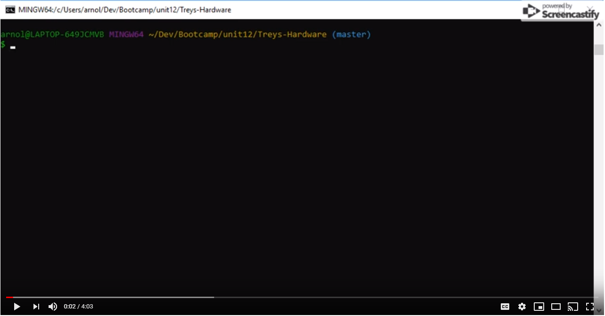

# Treys-Hardware
a CLI app simulating a store front.  This App uses Node and MySQL.

>Interface is set with inquirer to make the UI more user friendly

>You can purchase as a customer, or go into manager view to update inventory

